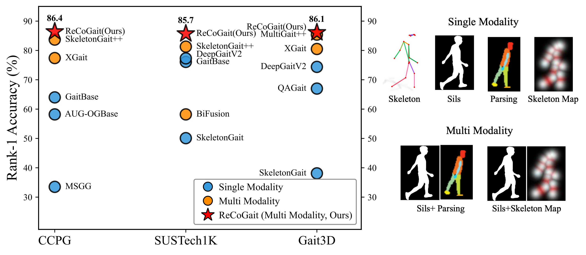

# ReCoGait

Official implementation of **ReCoGait: Reliability-Aware Cross-Modal Collaboration for Robust Silhouette-Skeleton Gait Recognition**.

ReCoGait is a dual-modal gait recognition framework that jointly exploits silhouette and skeleton-map representations. It improves cross-modal collaboration through Cross Gate Fusion (CGF), Temporal Gradient Interaction (TGI), and a Quality-Aware Loss for reliability-aware optimization.

## Environment and Dependency

ReCoGait is implemented as an extension to
[OpenGait](https://github.com/ShiqiYu/OpenGait) rather than as a standalone
framework. This repository provides the ReCoGait-specific model, loss function,
configurations, and execution scripts.

Please first install OpenGait by following its official environment and
dataset-preparation instructions. 

The experiments reported in the paper were conducted with:

- Python: 3.12
- PyTorch: 2.3.0
- CUDA: 12.1


## Repository Structure

```text
ReCoGait/
├── assets/
│   └── results.png
├── configs/
│   └── recogait/
│       ├── recogait_SUSTech1K.yaml
│       ├── recogait_CCPG.yaml
│       └── recogait_Gait3D.yaml
├── datasets/
│   ├── SUSTech1K/
│   │   └── SUSTech1K.json
│   ├── CCPG/
│   │   └── CCPG.json
│   └── Gait3D/
│       └── Gait3D.json
├── opengait/
│   └── modeling/
│       ├── models/
│       │   └── recogait.py
│       └── losses/
│           └── quality_aware_triplet_loss.py
├── train.sh
├── test.sh
├── LICENSE
└── README.md
```

## Data Preparation

We use the official preprocessed silhouette and skeleton modalities provided by
SUSTech1K, CCPG, and Gait3D. No additional silhouette segmentation or pose
estimation is required.

Please obtain each dataset from its official provider and organize it following
the OpenGait dataset-preparation instructions. Dataset paths and partition files
should then be specified in the corresponding configuration files.

- [SUSTech1K](https://lidargait.github.io)
- [CCPG](https://github.com/BNU-IVC/CCPG)
- [Gait3D](https://gait3d.github.io)

## Method Overview

<p align="center">
  
</p>

<p align="center">
  <em>Comparison of ReCoGait with representative gait recognition methods across different datasets and modality settings. The figure highlights the performance differences among single-modal, alternative multimodal, and silhouette--skeleton collaborative approaches.</em>
</p>

ReCoGait is designed to maintain effective silhouette--skeleton collaboration when the two modalities are affected by different forms of degradation. Given paired silhouette sequences and dense skeleton heat maps, the framework first extracts modality-specific features in a shared representation space.

Cross Gate Fusion (CGF) performs bidirectional cross-modal recalibration before deeper spatiotemporal modeling. Temporal Gradient Interaction (TGI) subsequently incorporates local forward and backward temporal differences to refine motion-sensitive features.

During training, ReCoGait computes a batch-relative skeleton-map intensity score and uses it to adapt the auxiliary triplet margin. Samples with higher normalized skeleton-map responses receive a larger auxiliary margin. This score is used only during training and is not involved in inference-time modality selection.

The overall training objective is:

```math
\mathcal{L}
=
\mathcal{L}_{\mathrm{tri}}
+
\mathcal{L}_{\mathrm{ce}}
+
\mathcal{L}_{\mathrm{qa}}.
```

## Training

Before training, select the configuration corresponding to SUSTech1K, CCPG, or Gait3D, and update its dataset path and environment-specific settings.
You can launch training with:

```bash
bash train.sh
```

## Evaluation

To evaluate a trained checkpoint, update the restore settings in the YAML configuration file and run:

```bash
bash test.sh
```

## Pretrained Checkpoints

Pretrained checkpoints are not distributed at this stage. The reported results
can be reproduced using the provided configurations and training scripts.

## License

The ReCoGait-specific code in this repository is provided for non-commercial academic research purposes only.

This project is built on OpenGait. OpenGait and all other third-party components remain subject to their original copyright notices and terms. This repository does not grant any rights beyond those terms.

See [LICENSE](LICENSE) for details.

